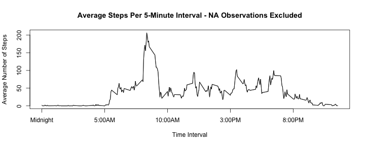
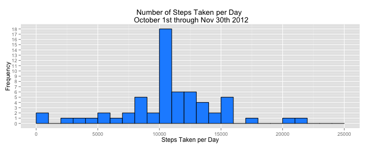
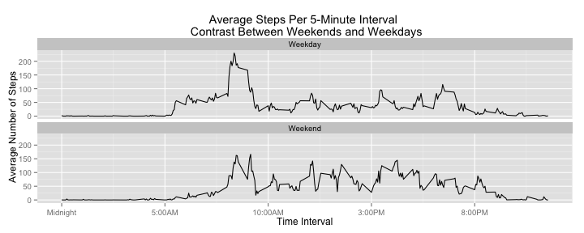

### Reproducible Research - Peer Assessment #1
#### Michael G. Farrell / July 18th, 2015

This assignment focuses on analysis of data collected from a personal activity monitoring device.  The data captured in the device consists of two months of data from an anonymous individual collected during the months of October and November 2012.  The base data set from the device captures in number of steps taken by the individual in 5 minute intervals on each day.  

This document is comprised of multiple parts and answers several questions posed in the assignment instructuctions about the data captured in the personal activity device.  The questions are answered using both plotting systems (such as ggplot2) and R code.

### Data

The source data for the analysis is in a comma-spearated values (CSV) file which can be downloaded from the following link. [Activity Monitoring Data](https://d396qusza40orc.cloudfront.net/repdata/data/activity.zip).

The variables in the data set are:

* **steps**:  Number of steps taken in a 5-minute interval (missing values are coded as 'NA')
* **date**:  The date on which the measurement was taken in YYYY-MM-DD format
* **interval**:  Identifier for the 5-minute interval in which measurement was taken

There are a total of 17,568 observations in the dataset.

### Loading and preprocessing the data

The data in the csv file was loaded into R using the read_csv() function.  The number of observations and variables loaded is confirmed with the structure function str().  At this point, no preprocessing is performed.


```r
# Load data into R
Activity_Detail <- read.csv("activity.csv")

str(Activity_Detail)
```

```
## 'data.frame':	17568 obs. of  3 variables:
##  $ steps   : int  NA NA NA NA NA NA NA NA NA NA ...
##  $ date    : Factor w/ 61 levels "2012-10-01","2012-10-02",..: 1 1 1 1 1 1 1 1 1 1 ...
##  $ interval: int  0 5 10 15 20 25 30 35 40 45 ...
```

### What is the mean total number of steps taken per day?

In this part of the assignment missing values in the data set, specifically observerations where the value for the steps variable is NA, can be ignored.

#### 1.  Calculate the total number of steps taken per day.

The first step is loading the dplyr library.  Functions in this library are used shape and query the data in order to answer several of the questions in this assignment.


```r
# Load dplyr library
library(dplyr)
```

The activity detail data is then loaded into a new data frame 'Activity_DateSumExNA' which summarized total number of steps per day, excluding observations where the value in the steps variable is 'NA.'


```r
# New data frame excluding NA values and summarizing total steps by day.
Activity_DateSum_ExNA <- Activity_Detail %>% filter(!is.na(steps)) %>% 
  group_by(date) %>% summarize(steps=sum(steps))

# First five records of the new data frame.
head(Activity_DateSum_ExNA,5)
```

```
## Source: local data frame [5 x 2]
## 
##         date steps
## 1 2012-10-02   126
## 2 2012-10-03 11352
## 3 2012-10-04 12116
## 4 2012-10-05 13294
## 5 2012-10-06 15420
```

#### 2. Make a histogram of the total number of steps taken each day

The following R code plots the data from the Activity_DateSum_ExNA data frame into a histogram.  First the library ggplot2 is loaded as this is used for several plots in this assignment.  The histogram plots the total number of steps taken per day binned into groups of 1000.  According to this plot, the most common number of steps per day was between 10,000 and 13,000 steps with a total of 20 days in this range.  The most frequent number of steps per day was at 10 days where there were between 10,000 and 11,000 steps.


```r
# Load ggplot2 library
library(ggplot2)
```

```r
# Histogram with 5-minute intervals binned into groups of 1000
g <- ggplot(data = Activity_DateSum_ExNA, aes(Activity_DateSum_ExNA$steps)) 
g <- g +  geom_histogram(breaks=seq(0, 25000, by = 1000),
  fill = I('dodgerblue'), binwidth = 0.20, color = I('black')) 
g <- g + scale_y_continuous(breaks = seq(0, 10, by = 1)) + 
  scale_x_continuous(breaks = seq(0, 25000, by = 5000))
g <- g + labs(x = "Steps Taken per Day") + labs(y = "Frequency")
g <- g + ggtitle('Number of Steps Taken per Day \n Oct 1st through Nov 30th 2012 - NA Observations Excluded')
g
```

 

#### 3. Calculate and report the mean and median of the total number of steps taken per day.

The the mean and median for the data set are virtually identical at **10766.19** and **10765** steps, respectively.  See below R code and results.


```r
# Calculate average number of steps per day.
mean(Activity_DateSum_ExNA$steps)
```

```
## [1] 10766.19
```

```r
# Calculate median number of steps across the data set.
median(Activity_DateSum_ExNA$steps)
```

```
## [1] 10765
```

### What is the average daily activity pattern?

#### 1.  Make a time series plot of the 5-minute interval (x-axis) and the average number of steps taken, averaged across all days (y-axis)

The following line plot illustrates the average number of steps taken per day across the two month period of activity.


```r
# Load new data frame with average steps per 5-minute interval.  Exlude NA observations.
Activity_IntervalSum_ExNA <- Activity_Detail %>% filter(!is.na(steps)) %>% 
  group_by(interval) %>% summarize(avg_steps=mean(steps)) 

# Load labels into vector which will be used to for the x-axis.
x<- c("Midnight", "5:00AM", "10:00AM", "3:00PM", "8:00PM")

# Line plot
with(Activity_IntervalSum_ExNA, plot(interval, avg_steps, type='l', xaxt="n", ylab="Average Number of Steps", xlab="Time Interval", main="Average Steps Per 5-Minute Interval - NA Observations Excluded"))
with(Activity_IntervalSum_ExNA, lines(interval, avg_steps))
axis(1, at=c(0,500,1000,1500,2000),labels=x)
```

 

#### 2.  Which 5-minute interval, on average across all the days in the dataset, contains the maximum number of steps?

Interval 835 has the highest average number of steps at **206.16** across the data set.


```r
# Use Dplyr 'top_n' funtion to get observation with highest average steps.
top_n(Activity_IntervalSum_ExNA,1, avg_steps)
```

```
## Source: local data frame [1 x 2]
## 
##   interval avg_steps
## 1      835  206.1698
```

### Inputing missing values

#### 1.  Calculate and report the total number of missing values in the dataset (i.e. the total number of rows with NAs)

A total of **2,304** rows have a value of 'NA' in the steps variable.


```r
# Calculate number of rows with NAs
Activity_Detail %>% 
  filter(is.na(steps)) %>% 
  group_by(steps) %>% 
  summarize(records=n())
```

```
## Source: local data frame [1 x 2]
## 
##   steps records
## 1    NA    2304
```

#### 2.  Devise a strategy for filling in all of the missing values in the dataset.

The approach to populate observations with 'NA' in the steps variable will be to replace this value with the average number of steps for the interval across the data set.  In this case, the data frame Activity_IntervalSum_ExNA which has already been created and has the average steps per interval calculated, will be leveraged.  This data set will first be joined to the Activity_Detail data frame by interval.  Note that NAs are included in this data set.  Next R code will be run with a conditional ifelse function to replace the value in the steps variable with the mean for the interval, if the observation contains 'NA.'

#### 3.  Create a new dataset that is equal to the original dataset but with the missing data filled in.

The above strategy is implemented with the below R code.  Note that the new data frame contains the same number of observations **17,568** and variables **3**.


```r
# Join Activity_IntervalSum_ExNA to Activity Detail, create new data frame.
Activity_Detail_Prep <- left_join(Activity_Detail, Activity_IntervalSum_ExNA, by = "interval")

# Create new data set with same structure, number of observations and variables.
Activity_Detail_New <- Activity_Detail_Prep %>% 
  mutate(new_steps = ifelse(is.na(steps), round(avg_steps), round(steps))) %>% 
  select(steps=new_steps, date, interval)

# First five records of new data frame.  Note that values in steps variable are populated.
head(Activity_Detail_New, 5)
```

```
##   steps       date interval
## 1     2 2012-10-01        0
## 2     0 2012-10-01        5
## 3     0 2012-10-01       10
## 4     0 2012-10-01       15
## 5     0 2012-10-01       20
```

```r
# Structure of new data frame.  Number of variables and observations matches original data set.
str(Activity_Detail_New)
```

```
## 'data.frame':	17568 obs. of  3 variables:
##  $ steps   : num  2 0 0 0 0 2 1 1 0 1 ...
##  $ date    : Factor w/ 61 levels "2012-10-01","2012-10-02",..: 1 1 1 1 1 1 1 1 1 1 ...
##  $ interval: int  0 5 10 15 20 25 30 35 40 45 ...
```

#### 4.  Make a histogram of the total number of steps taken each day and Calculate and report the mean and median total number of steps taken per day. Do these values differ from the estimates from the first part of the assignment? What is the impact of imputing missing data on the estimates of the total daily number of steps?

The below histogram illustrates the distribution of total number of steps each day.  The most obvious difference between this histogram on the original, where NAs were excluded, are that the number of days where number of steps was between 10,000 to 11,000 increased from 10 to 18 days.


```r
# Load summary with total steps by day into data frame.
Activity_DateSum <- Activity_Detail_New %>% group_by(date) %>% summarize(steps=sum(steps)) 

# Create histogram with 5-minute intervals binned into groups of 1000.
g <- ggplot(data = Activity_DateSum, aes(Activity_DateSum$steps)) 
g <- g +  geom_histogram(breaks=seq(0, 25000, by = 1000),fill = I('dodgerblue'), binwidth = 0.20, color = I('black')) 
g <- g + scale_y_continuous(breaks = seq(0, 20, by = 1)) + scale_x_continuous(breaks = seq(0, 25000, by = 5000))
g <- g + labs(x = "Steps Taken per Day") + labs(y = "Frequency")
g <- g + ggtitle('Number of Steps Taken per Day \n October 1st through Nov 30th 2012')
g
```

 

The the mean and median for the data set are mostly unchanged and are still nearly identical to one another at **10765.64** and **10762** steps, respectively.  The approach of using the mean to replace NAs is likely the reason there was not much change in the mean and medial compared to the original data set.  See below R code and results.


```r
# Calculate average number of steps per day.
mean(Activity_DateSum$steps)
```

```
## [1] 10765.64
```

```r
# Calculate median number of steps across the data set.
median(Activity_DateSum$steps)
```

```
## [1] 10762
```

### Are there differences in activity patterns between weekdays and weekends?

#### 1.  Create a new factor variable in the dataset with two levels – “weekday” and “weekend” indicating whether a given date is a weekday or weekend day.

A new data frame Activity_IntervalSum_Weekend is created with the below R code.  Note that the weekdays() function was leveraged to identify the day of week for a date, then a simple ifelse function is used to populate a value of 'Weekend' when the first letter of the day of week is 'S', else 'Weekday' is populated.

This data frame summarizes the average number of steps by Weekend or Weekday by interval and will be used in the subsequent plot to contrast activity by Weekend or Weekday.


```r
# Load new data frame with summary by Weekend/Weekday, Interval, and average steps.
Activity_IntervalSum_Weekend <- Activity_Detail_New %>% 
  mutate(Weekend_Weekday = ifelse(grepl('^S', weekdays(as.POSIXct(Activity_Detail_New$date))), "Weekend", "Weekday")) %>%
  group_by(Weekend_Weekday, interval) %>% summarize(avg_steps=mean(steps)) 

# Show first five records of new data frame.
head(Activity_IntervalSum_Weekend,5)
```

```
## Source: local data frame [5 x 3]
## Groups: Weekend_Weekday
## 
##   Weekend_Weekday interval  avg_steps
## 1         Weekday        0 2.28888889
## 2         Weekday        5 0.40000000
## 3         Weekday       10 0.15555556
## 4         Weekday       15 0.17777778
## 5         Weekday       20 0.08888889
```

#### 2.  Make a panel plot containing a time series plot of the 5-minute interval (x-axis) and the average number of steps taken, averaged across all weekday days or weekend days (y-axis). 

The below time series plot illustrates the contrast in activity between weekdays and weekends throughout the course of a day.  Activity on weekdays begins shortly after 5:00am.  Weekdays have spikes in activity around the 8:00 to 9:00am time frame at approximately 200 steps per 5-minute interval, then activity ramps down to a range of 50-100 steps for the remainder of the day until around 8:00pm.  On weekends, however, the activity starts closer to 7:30 to 8:00am and the peak of actvity is also at around the 8:00 to 9:00am window but is less than weekdays at just over 150 steps.  Throughout the course of the day the average number of steps per five minute interval holds in a range of around 50 to 150 steps per hour until around 5:00pm and remains at 50 steps per hour beyond 8:00pm.  These plots illustrate that the individual got off to a later start but had more consistent and sustained activity on weekends.


```r
# Load labels into vector which will be used to for the x-axis.
x<- c("Midnight", "5:00AM", "10:00AM", "3:00PM", "8:00PM")

# Line plot illustrating avg number of steps per 5-minute interval.  Separate facets for weekends and weekdays.
g <- ggplot(Activity_IntervalSum_Weekend, aes(interval, avg_steps)) + geom_line()
g <- g + facet_wrap(~ Weekend_Weekday, ncol = 1) + labs(x = "Time Interval") + labs(y = "Average Number of Steps")
g <- g + ggtitle('Average Steps Per 5-Minute Interval \n Contrast Between Weekends and Weekdays')
g <- g + scale_x_continuous(breaks=c(0,500,1000,1500,2000), labels=x)
g
```

 

This concludes the Reproducible Research Peer Assessment #1 assignment.
